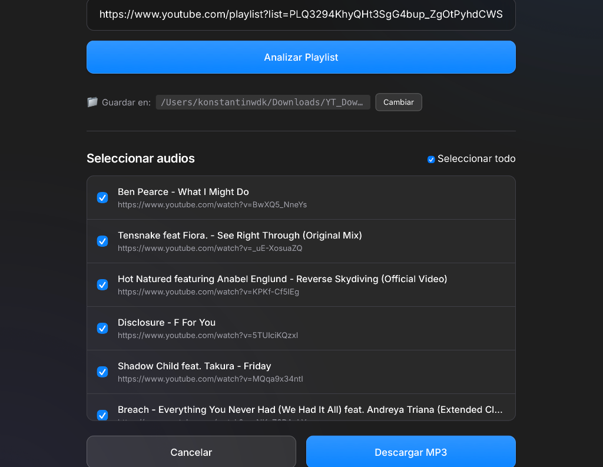

# 🎵 YouTube MP3 Downloader



Una aplicación nativa para **Windows** y **macOS**, rápida y ligera construida con **Flask**, **yt-dlp** y **FFmpeg** para descargar y convertir videos y listas de reproducción de YouTube a audio **MP3 (192 kbps)** de alta calidad.

---

## ✨ Características

- 🎧 **Conversión de Alta Calidad**: Extracción directa a MP3 (192 kbps) con FFmpeg integrado.
- 📋 **Soporte de Listas y Lotes**: Descarga videos individuales o playlists completas.
- 📁 **Integración Nativa**: Selección de carpeta de descargas desde la interfaz y apertura directa en el explorador de archivos / Finder.
- 🚀 **100% Autónoma**: No requiere Python, FFmpeg ni dependencias en tu ordenador. Instalar y usar.

---

## 💻 Instalación y Descargas

Puedes descargar la aplicación directamente desde la web oficial de producción o desde la carpeta `releases/` de este repositorio:

🌐 **Web oficial de descarga:** [https://yt-list-dwnld.konstantink.dev/](https://yt-list-dwnld.konstantink.dev/)

### 🪟 Windows
1. Descarga el archivo ejecutable **`YouTubePlaylistDownloader.exe`** desde la [web oficial](https://yt-list-dwnld.konstantink.dev/) o la carpeta `releases/`.
2. Ejecuta el archivo `.exe` con doble clic. *(Si Windows SmartScreen muestra un aviso preventivo por ser una app open-source, haz clic en **Más información** y luego en **Ejecutar de todas formas**)*.
3. ¡Listo! Ya puedes configurar tu carpeta y descargar música.

### 🍎 macOS
1. Descarga el archivo instalador **`YouTubePlaylistDownloader.dmg`** desde la [web oficial](https://yt-list-dwnld.konstantink.dev/) o la carpeta `releases/`.
2. Abre el archivo `.dmg` y arrastra la aplicación a tu carpeta de **Aplicaciones**.
3. ¡Abre la app y empieza a descargar!

---

## 🌐 Despliegue Web (Landing Page)

La aplicación incluye un modo web (`WEB_MODE=True`) diseñado para ser desplegado en servicios como **Coolify** o servidores VPS (puedes ver la versión en producción funcionando en [https://yt-list-dwnld.konstantink.dev/](https://yt-list-dwnld.konstantink.dev/)). 
Al desplegarse en web, **las descargas directas se desactivan por seguridad**. La interfaz web se transforma en una *Landing Page* promocional que permite a los visitantes descargar el instalador para **Windows (.exe)** o **macOS (.dmg)**.

### Despliegue rápido con Docker
```bash
git clone https://github.com/<TU-USUARIO>/youtube-playlist-downloader.git
cd youtube-playlist-downloader
docker compose up -d --build
```
Abre `http://localhost:5006` para ver la Landing Page.

*Nota: Para habilitar el modo de descargas en la web localmente, puedes iniciar la app con `WEB_MODE=false python app.py`.*

---

## 🛠️ Desarrollo y Compilación

### 🪟 Compilar en Windows (.exe)
Puedes compilar con cualquiera de los scripts incluidos:
- **Doble clic o Batch**: `build_windows.bat`
- **PowerShell**: `.\build_windows.ps1`

El ejecutable resultante se empaquetará automáticamente y se copiará a `dist/` y a `releases/YouTubePlaylistDownloader.exe`.

### 🍎 Compilar en macOS (.dmg / .app)
1. Instala las dependencias del sistema:
   ```bash
   brew install create-dmg
   ```
2. Ejecuta el script de construcción:
   ```bash
   bash build_mac.sh
   ```
3. Encontrarás el nuevo `.dmg` en la carpeta `dist/` y `releases/`.

---

## ⚖️ Licencia y Aviso Legal

Este proyecto se distribuye bajo la licencia MIT con fines educativos y de uso personal. Asegúrate de cumplir con los términos de servicio de YouTube y las leyes de derechos de autor aplicables en tu jurisdicción.
